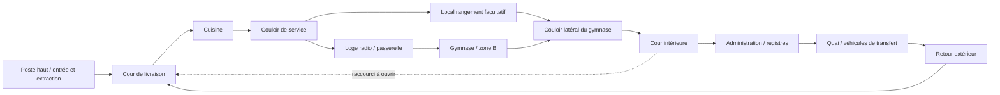

# Expédition 01 — Ne rétablissez pas le secteur B

Spécification de construction v1 · 6 septembre 2026

Référence narrative : [Bible v1](ZOMBIESEASONS_BIBLE_V1.md). Cette spécification décrit une cible ; les interactions, événements et sauvegardes ne sont pas encore implémentés.

## Résultat attendu

Le joueur établit la liaison avec le barrage, traverse les conséquences de la reprise de B, découvre que le groupe B-04 était encore présent après son départ officiel et rapporte ces preuves au point de sortie. Le document logistique désigne le poste du motel comme prochaine destination.

Cible première découverte : 25–35 minutes, ouverture 10–12 minutes environ. Les durées sont des hypothèses de test ; aucun allongement par attente ou allers-retours artificiels.

## Implantation

Enveloppe de travail indicative : 180 × 140 m incluant les extérieurs, avec un gymnase de l'ordre de 32 × 20 m et des annexes modestes. Ces valeurs servent aux essais à échelle humaine, pas à un plan d'architecte. Le terrain reçoit un dénivelé doux de quelques mètres ; les circulations intérieures critiques restent sur un niveau.

Le point d'entrée est sur la partie haute. Le gymnase et le quai de service se situent plus bas, expliquant leurs marques d'eau. L'administration occupe une partie plus sèche. La ligne d'eau doit suivre l'altitude d'un ancien niveau commun, pas une hauteur décorative identique sur des sols différents.

Le barrage peut se lire dans une échappée depuis la cour et au retour. Son orientation et son altitude seront décidées à l'intégration ; ne pas importer aveuglément les anciennes coordonnées mondiales.

Les deux passages de combat dans le gymnase constituent des options locales avant de rejoindre la cour. Le local facultatif améliore l'accès à l'une de ces options ; il ne doit pas être indispensable pour survivre. L'entrée de service reste un repli : le scénario ne verrouille pas subitement toutes les portes derrière le joueur.

## Déroulement complet

### 1. Cour — lire l'ancien centre d'accueil

Objectif affiché : « Rejoindre le poste de communication de l'école ». Le joueur découvre les panneaux temporaires, bagages et véhicules. La grande entrée publique est impraticable depuis le début, pas fermée sous ses yeux sans raison. La livraison reste identifiable par son enseigne et le trajet de service.

Une vue de référence doit montrer l'entrée utile, un fragment de la vie d'avant et la trace de l'évacuation. Éviter de cumuler tous les accessoires dans cette vue.

### 2. Cuisine — premier contact

Rencontre courte avec les zombies existants. Les pièces et seuils fournissent leurs positions initiales et un repli vers la cour. Le mobilier suit la distribution des repas ; il ne forme pas un labyrinthe arbitraire. Aucun nouveau comportement d'IA requis pour ce passage.

### 3. Service et loge — observation et préparation

Le joueur voit une partie du gymnase et quelques infectés derrière une séparation sportive existante. Le tableau montre une alimentation présente, une liaison interrompue et des services B inhibés.

Consigne : « Communications seules. Laisser B isolé ». L'interaction utile est explicitement « Rétablir la liaison », jamais un interrupteur ambigu qui ferait croire que le joueur a ignoré la consigne.

Option : explorer le rangement et débloquer de l'intérieur sa porte vers le couloir latéral. Un élément de soin ou une réserve modeste peut y récompenser l'exploration, seulement si le système correspondant existe. L'amélioration de parcours suffit à justifier le détour.

### 4. Incident B — causalité visible

Après interaction, trois retours distincts : voyant de liaison, message « Ordre distant reçu », puis commutation des services de B. Le premier échange radio est interrompu par la reprise des éclairages et du message d'accueil. Le même événement se comprend sans entendre les voix, via les états et sous-titres.

Répliques de travail, courtes :

> Opératrice : « Poste école ? Vous m'entendez ? »
>
> Annonce : « Transfert B. Veuillez rejoindre la zone d'embarquement. »
>
> Opératrice : « B a repris ? Alors la séquence est encore active. Sortez de la salle. »

Pas de porte prétendument hors tension qui s'ouvre grâce au réseau. La séparation du gymnase possède déjà des ouvertures : les ennemis s'en rapprochent et utilisent les accès physiques.

### 5. Gymnase — se frayer une sortie

Objectif : « Rejoindre la cour intérieure ». Aucun quota d'éliminations requis pour déverrouiller la sortie. Les lits occupent surtout les périphéries ; gradins repliés et un bloc de rangement structurent une boucle. Les accessoires fins ne doivent pas accrocher les déplacements.

Deux trajectoires réellement praticables à tester : traversée centrale exposée ; contour plus protégé mais plus long. Leur jonction ne doit pas être un unique étranglement où tous les ennemis se concentrent.

Les infectés initiaux sont déjà présents. Les renforts éventuels viennent de pièces ou accès existants, hors vue, avec plafond mesuré. Le compte cible est une variable de tuning, pas un nombre inventé à reproduire dans le code. Si le joueur retraite avant la salle, la rencontre continue de façon cohérente ; aucun téléportage de secours.

### 6. Cour intérieure — bénéfice visible

Le joueur ouvre un raccourci physique vers la cour de livraison. La découverte ne valide pas encore toute l'expédition : elle réduit le risque de retour et permet d'aborder l'administration. Pause sonore relative ; pas de sécurité surnaturelle dans cette cour.

### 7. Administration — preuve de présence

Dans un poste d'accueil improvisé, un registre local signé à 17 h 40 recense encore des personnes du groupe B-04. Une liste officielle datée plus tôt déclare leur départ à 15 h 20. Le même identifiant, les mêmes noms fictifs et la même date rendent la contradiction compréhensible.

La lecture rapprochée bénéficie d'une transcription claire. Le joueur ne doit pas déchiffrer de petites textures. Les documents utiles peuvent être archivés via une interaction simple ; si aucun journal n'existe, implémenter seulement les deux entrées requises plutôt qu'un système encyclopédique.

Le rapprochement établit une contradiction. Il ne prouve pas encore l'intention de falsifier, ni la mort de toutes les personnes du groupe.

### 8. Quai — indice matériel et objectif secondaire

Un véhicule identifié sur la liste est resté du côté où il devait venir chercher les passagers. C'est un indice qui renforce les documents, pas une preuve suffisante à lui seul.

Si aucun minibus adapté n'est disponible, ne pas lui substituer silencieusement une voiture quelconque. La preuve documentaire suffit pour le premier lot ; la mise en scène du véhicule reste une dépendance artistique explicite.

Objectif secondaire léger : retrouver le trajet d'une partie du groupe vers une sortie latérale, indiqué par une correction du plan et des effets transportés. Il ouvre une cache ou une observation différente, sans établir artificiellement le sort de chacun. Pas de nouvelle mécanique de sauvetage d'un compagnon dans ce lot.

### 9. Retour — finir l'expédition

Retour extérieur court vers le poste haut, en utilisant les accès ouverts. Un risque résiduel est possible, sans deuxième grosse vague obligatoire. L'extraction demande une interaction lisible au point de sortie ; elle rapporte les preuves et identifie le motel comme suite.

Premier prototype : fin de parcours explicite et relance contrôlée. Version jouable complète : sauvegarder l'expédition réussie avant d'afficher sa réussite. Ne pas annoncer une progression permanente avant que le système existe et soit vérifié.

## États de scénario à prévoir

- Initial : liaison coupée, alimentation auxiliaire présente, services B inhibés.
- Liaison rétablie : commande reçue et incident déclenché une seule fois.
- Cour atteinte : objectif administratif disponible, raccourci ouvrable.
- Preuves acquises : deux faits enregistrés indépendamment ; ordre de lecture libre.
- Extraction disponible : liaison rétablie et preuves acquises. Les morts ennemies ne sont pas une condition de fin.
- Terminé : réussite enregistrée une seule fois lorsque la sauvegarde est implémentée.

L'ouverture facultative de la porte est un état indépendant. Une recharge devra restaurer l'état local et ne pas rejouer automatiquement l'annonce, redonner une récompense ou dupliquer les ennemis. Le métier est porté par un composant/scénario local dédié, pas incorporé au contrôleur de tir.

## Direction artistique applicable

Trois vues suffisent à cadrer la première production : cour vers la livraison ; vitre donnant sur le gymnase avant reprise ; même salle pendant l'activation partielle. Une image conceptuelle ne constitue ni un inventaire d'assets ni une validation de la map.

- Matériaux dominants : brique et béton peint, bois de sport usé, acier, toile.
- Palette : gris chaud, bleu scolaire délavé, vert kaki des équipements ; ambre limité aux sources électriques.
- Lumière : jour froid diffus ; allumage local perceptible sans plonger le reste dans une obscurité illisible. Éviter une exposition automatique qui annule la différence entre états.
- Usure : humidité au bas des parois, traces d'eau cohérentes, objets déplacés en hauteur, zones de passage nettoyées. Pas de saleté uniforme.
- Son : eau, bâches, structures, puis une annonce distincte. Les sous-titres et retours visuels rendent l'événement accessible.
- Objets : chaque ensemble répond à un ancien usage, un événement de crise ou un besoin de jeu. Garder volontairement des surfaces vides.

## Validation qui autorise l'habillage complet

1. Parcours réalisable avec le pawn et les zombies du projet, sans commande de debug.
2. Deux options de mouvement utilisables dans la rencontre, même sans préparation facultative.
3. Repli avant et pendant l'incident sans verrouillage narratif inexpliqué.
4. Pas de zombie apparaissant dans le champ, traversant une paroi ou disparaissant à une frontière de zone.
5. Commande de liaison répétée sans double événement ; documents lisibles dans les deux ordres.
6. Différence claire entre alimentation, connexion et ordre reçu, compréhensible sans audio.
7. Contradiction des registres comprise sans long dialogue.
8. Mesure du temps réel et du coût CPU/GPU sur matériel identifié. Aucun chiffre de FPS promis avant mesure.

Les vérifications techniques sont automatisées quand possible. Le retour humain porte sur une visite complète et trois vues fixes, pas sur chaque script.
