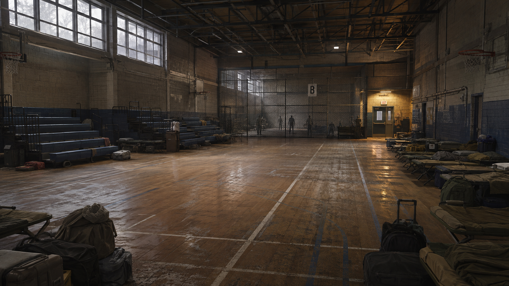

# Premier lot Unreal — passer de la vision au secteur école

Plan de production v1 · 6 septembre 2026

## Décision de portée

Produire le parcours école de [l'expédition 01](EXPEDITION_01_SECTEUR_B.md), en commençant par cour, cuisine, couloir, loge et gymnase. Réutiliser le gameplay satisfaisant. L'extension aux autres quartiers attend les enseignements de cette zone.

Le premier résultat doit comprendre un parcours fonctionnel et une portion d'habillage représentative. Un amas de primitives sans mise à l'échelle, ni parcours essayé, n'est pas un jalon suffisant ; un décor sans collision et sans jeu non plus.

## État vérifié avant production

- Projet local : `C:/Users/malik/Documents/Unreal Projects/ZombieSeasons`.
- Branche observée lors de l'audit : `feat/unreal-ai-map-generation`, commit local `7734567`. Recontrôler avant écriture.
- Unreal installé : **5.5.4**, confirmé dans `Engine/Build/Build.version`.
- Les logs locaux montent `PythonScriptPlugin` et `EditorScriptingUtilities`.
- Le Stage 13 enregistré a créé `L_ZS_World`, avec 76 éléments d'habillage, sans collision, et 12 routes texturées. Il ne certifie pas une zone finale.
- Les maps et de nombreux acteurs possèdent des changements locaux, dont certains déjà indexés. Aucun reset, nettoyage global, commit global ou régénération de ces fichiers.
- Le rapport greybox contient trois projections de spawns échouées dans les égouts malgré le statut global PASS. Il n'est pas une certification du nouveau secteur.

## Livraison A — secteur école et référence visuelle

1. Actualiser l'état Git et identifier les fichiers appartenant au travail existant. Préserver ensemble la map et ses acteurs externes. La production nouvelle doit avoir sa propre destination ; ne pas copier/écraser seulement un `.umap` World Partition.
2. Préparer un niveau de développement dédié, destination proposée `/Game/ZombieSeasons/Maps/Development/L_ZS_School_Expedition`. Vérifier son absence avant création. Le choix du mode de streaming est local à ce besoin ; ne pas recopier tous les réglages d'un monde de plusieurs kilomètres par habitude.
3. Construire les volumes à l'échelle du personnage réel. Tester portes, angles, vue depuis la loge, deux routes de gymnase et raccourci.
4. Associer explicitement le bon GameMode/FPS au niveau dédié. Ne pas changer les maps de démarrage globales ou le contrôleur satisfaisant.
5. Intégrer la liaison, l'annonce et la sortie avec un scénario local et des événements rejouables sans doublons. Le runtime reste C++/Blueprint ; Python sert à fabriquer et vérifier le contenu dans l'éditeur.
6. Habiller la vue du gymnase et un raccord extérieur avec les assets réellement utilisables. Aucun redimensionnement aveugle d'un élément quelconque pour en faire un bâtiment.
7. Livrer le secteur et un compte rendu distinguant : fichiers générés, test en jeu, contrôle visuel, performance. Un PASS de script ne remplace pas les autres.

## Livraison B — expédition complète

Administration, documents, quai, retour, fin de parcours ; puis interactions de journal et sauvegarde strictement nécessaires. Retours visuels/audio, collisions et navigation sur les géométries finales. Les accessoires ajoutés ne doivent pas rester sans collision lorsqu'ils représentent un obstacle attendu par le joueur.

## Livraison C — finition et extension

Profilage, corrections de matériaux/éclairage, sons définitifs, sauvegarde et reprise, puis essai packagé. Les routes vers le motel découlent du premier niveau validé ; pas de construction des quatre quartiers en parallèle avant cette référence.

## Dépendances artistiques

La vérification du manifeste de production trouve les fichiers `.uasset` des **201 références activées**. Cela prouve leur présence sur disque, pas leur chargement dans Unreal, leur aptitude artistique ou leurs performances. De nombreuses entrées ont une approbation `AUTO_POLICY` ; elle ne remplace pas la revue visuelle.

Candidats identifiés : 32 façades et 32 éléments d'architecture générale City Sample ; sols `SM_Ind_Unf_FloorPlane_01/02` dans `Scene_UnfinishedBuilding` ; matériau `MI_AsphaltMat_Inst9` ; portes `SM_PROP_NYA_A_Door_*` et `StarterContent/Props/SM_Door` ; candidat autocar `BP_vehicle10_Bus` ; lampe `SM_Ind_War_Light_Ceiling_Metal_Hanging_02`. Il faut choisir une famille architecturale cohérente. Un mesh d'entrée n'est pas une porte interactive et une lampe décorative n'est pas un éclairage fonctionnel.

Une liste approuvée n'est pas une preuve d'aptitude à composer une école. Avant placement final, contrôler dimensions, pivot, raccords, matériaux, collisions et coût des pièces sélectionnées.

Pour les éléments de réception et de gymnase, identifier de vrais candidats pour lits de camp, chariots, gradins, mobilier administratif et minibus adapté. En l'absence de candidat vérifié, garder le manque visible dans le suivi. Le blockout utilise des volumes neutres nommés ; il ne prétend pas avoir livré ces objets.

La recherche par noms dans `GeneratedAuditLight/assets_light.csv` n'a pas identifié de lits de camp, brancards, fauteuils roulants ou mobilier scolaire dédié. Ce résultat doit être confirmé par inspection, pas transformé en affirmation que ces objets n'existent nulle part dans les packs.

Les petits panneaux, listes de transfert et papiers peuvent être des assets propres au projet, cohérents et lisibles. Les preuves essentielles doivent aussi disposer d'une transcription. Les noms dans les documents sont fictifs.

## Raccordement au gameplay existant

La revue de `Plugins/ZombieSeasonsRuntime/Source/ZombieSeasonsRuntime/Private/ZSGameplayRuntimeSubsystem.cpp` identifie une séquence de 25 anciens objectifs codée en dur et des déclenchements par proximité. Ils ne constituent pas le scénario B : la rencontre doit suivre la reconnexion, pas le franchissement prématuré d'un rayon de horde.

Prévoir une activation explicite du scénario de cette map et un composant dédié à ses états ; réemployer les capacités de combat disponibles sans modifier le contrôle FPS. Vérifier qu'aucune initialisation globale de l'ancien monde ne s'applique à ce nouveau niveau. La sauvegarde d'expédition et la séquence électrique/radio B n'ont pas été identifiées dans les fichiers examinés ; elles restent à implémenter.

## Référence visuelle produite

Image produite avec Imagegen intégré, pas une capture Unreal. Elle fixe surtout l'échelle, les matériaux, le contraste jour froid / éclairage local et les traces d'accueil. Le [prompt exact](PROMPT_CONCEPT_GYMNASE_B.txt) accompagne le fichier.

Revue : bonne sobriété du décor et bonne lecture du fond de salle. Le cadrage ne démontre pas les deux circuits de combat ; les ouvertures de la séparation et le second débouché devront être explicites dans la géométrie jouable. Adapter aussi la signalétique à la langue retenue ; ne pas recopier automatiquement le panneau EXIT du concept. La photographie conceptuelle ne remplace pas ces vérifications.

## Outils utiles maintenant

- **GitHub :** connexion déjà utilisée pour inspecter le dépôt ; pas de nouveau plugin nécessaire pour cette capacité.
- **Imagegen intégré :** une référence artistique du gymnase est lancée dans cette livraison. Elle fixe composition, lumière et densité, pas une promesse de rendu Unreal ni un modèle 3D prêt à importer.
- **Python Unreal 5.5 :** déjà chargé dans les logs. Sert au placement, aux inventaires et aux validations. Référence officielle : [API Python Unreal 5.5](https://dev.epicgames.com/documentation/en-us/unreal-engine/python-api/introduction?application_version=5.5).
- **Editor Scripting Utilities :** déjà chargé ; utiliser les API compatibles 5.5, en privilégiant les sous-systèmes actuels lorsque les anciens appels sont dépréciés.
- **Connexion directe de pilotage Unreal :** aucun outil Unreal dédié n'a été identifié parmi les outils appelables de cette session. Les scripts Unreal restent une voie utilisable, mais l'exécution et la capture de l'éditeur doivent être validées avant de promettre un travail entièrement autonome. L'absence d'outil ici ne prouve pas qu'aucun plugin tiers n'existe.

Aucun achat d'assets, abonnement supplémentaire ou installation tiers n'est nécessaire pour finaliser la conception et démarrer les essais de parcours. Un besoin d'asset manquant sera établi sur une scène concrète avant de proposer une acquisition. Les outils web/vidéo visibles sur les captures ne remplacent pas l'intégration Unreal.

## Méthode pour accélérer sans multiplier les interventions

Le travail se groupe par livraisons. Une revue indépendante du récit et une revue des ressources peuvent avancer en parallèle. Les modifications d'un même niveau, de ses acteurs et de ses assets sont coordonnées et sérialisées ; plusieurs agents ne modifient pas simultanément la même map.

Les décisions courantes de placement restent dans le périmètre de la bible. Les changements majeurs sont consignés avec leur raison. On ne réclame pas une validation pour chaque accessoire.

Le créateur examine une zone traversable, trois vues fixes et une liste courte de points à juger. Le projet reste en 5.5.4 ; aucune migration de moteur n'est prévue pour ce lot.

**À ne plus faire :** étendre le lore sans besoin du niveau, imposer les 470 anciens marqueurs à cette expédition, qualifier une scène de finale au nombre d'acteurs, remplacer silencieusement un asset manquant ou généraliser l'habillage avant un essai à hauteur du joueur.
